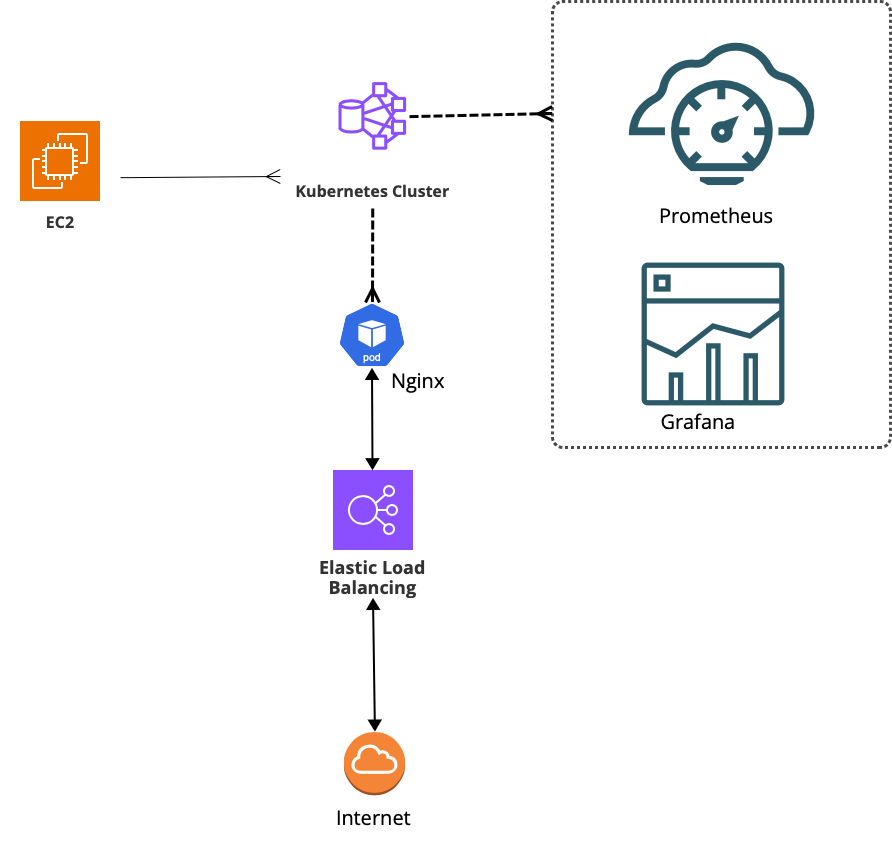

# Proyecto Devops 2024 - PIN2 - Mundo E

## Raúl B. Netto y Gabriela Ratti

EEste proyecto tuvo como idea principal el aprendizaje sobre distintos temas y la puesta en práctica mediante un laboratorio que permita integrar diferentes herramientas y tecnologías. Durante la primera parte nos centramos en la creación de una instancia de `EC2` en *AWS* para poder desde allí realizar todas las tareas necesarias, como montar un cluster Kubernetes, preparar un balanceador de Carga e instalar `Nginx` además de diversos Pods para monitoreo del cluster con el stack de `Prometheus` y `Grafana`

## Contenido del proyecto

1. Crear y configurar instancia EC2

2. Configurar instancia y cliente AWS

3. Crear cluster con eksctl

4. Configurar kubectl

5. Herramientas de monitoreo

## Reporte PIN2
Para acceder al reporte complete ir al siguiente enlace:

# Bibliografía

* https://www.youtube.com/watch?v=z6CxN7zRoPk
* https://www.youtube.com/watch?v=AhfZxzD2g80
* https://global-timpani-13b.notion.site/Creando-un-pacman-en-k8s-97c3de6074d04a44952c3779eeba717a

